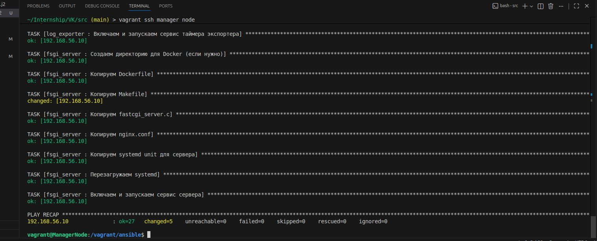
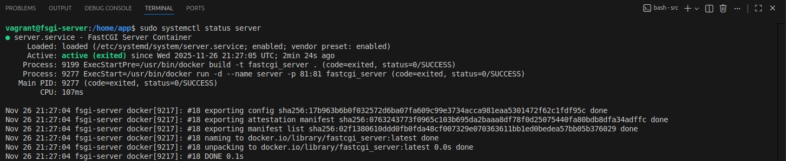
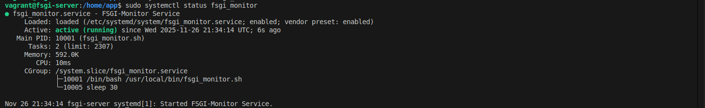
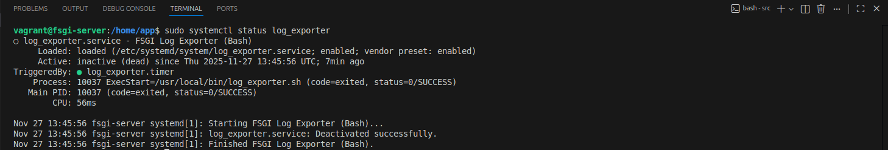

# Цель

Необходимо создать систему мониторинга веб-приложения с автоматическим перезапуском при сбоях.

# Решение

Для симулирования удаленных серверов решил использовать VirtualBox и Vagrant для автоматизации.
Были созданы 2 машины: manager_node и fsgi_server. 

В конфигурации Vagrantfile для manager_node была написана дополнительная конфигурация для автоматической установки Ansible. Ansible в этом проекте используется для удаленного автоматического конфигурирования удаленного сервера нашей системой.
Также с виртуальной машины сервера(fsgi_server) был проброшен порт для доступа в локальной машине User Interface нашего веб-приложения.

Ansible заупсукается на manager_node, так как мы создали наши хосты в VirtualBox через vagrant настройку доступа по ssh между manager_node и fsgi_server делать не надо, достаточно указать в Inventory(file Ansible) путь к private_key Vagrant'a в переменной Ansible.

### Сервисы Ansible:

    Server: stack(C, FASTCGI) проксируется через nginx и работает внутри Docker-container который установлен как systemd служба

    Monitoring Service: Сервис на основе Bash-скрипта который в интервале определенного времени отправляет запрос на сервер и пишет логи в файл также при ошибках пытается перезапустить сервер, также работает как systemd служба

    Log-Exporter Service: Сервис на основе Bash-скрипта который читает лог файл и отправляет данные по телеграм боту пользователю, работает как systemd служба

 Запуск ansible-playbook

Работа Systemd-сервисов:

 Server Service

 FSGI-Monitor Service

 Log Exporter Service

